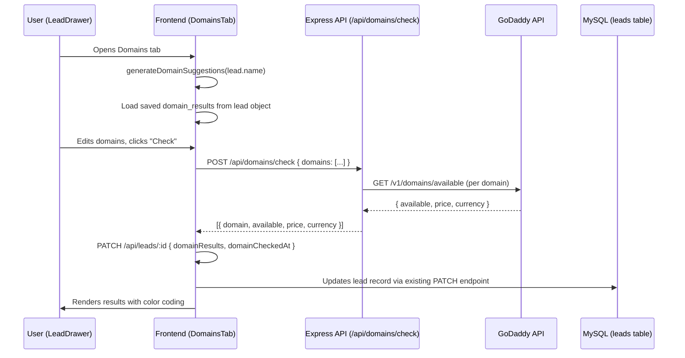

# Design Document: Domain Price Checker

## Overview

The Domain Price Checker adds a "Domains" tab to the existing LeadDrawer component, enabling users to check domain availability and pricing for leads directly within their evaluation workflow. The feature auto-suggests domain names from the business name (with Greek business name cleanup logic), allows editing/adding custom domains, queries a domain registrar API for availability and pricing, and persists results to the lead's MySQL record.

The system follows the existing Express + React architecture: a new server-side route (`/api/domains/check`) proxies requests to the GoDaddy OTE/Production API (chosen for its straightforward availability + pricing endpoint), and the frontend adds a new tab component that manages domain suggestions, check state, and result display.

### Key Design Decisions

1. **GoDaddy API** chosen over WHOIS+pricing because GoDaddy's `/v1/domains/available` endpoint returns both availability AND pricing in a single call, supports bulk checks, and has a free OTE (test) environment. The API key stays server-side.

2. **JSON column on leads table** rather than a separate `domain_results` table — keeps the data model simple and consistent with how `screenshot_files`, `top_reviews`, and other per-lead JSON data is already stored.

3. **Domain suggestion logic runs client-side** — it's pure string manipulation with no secrets, and running it on the client avoids a round-trip for every drawer open.

## Architecture



The architecture reuses the existing patterns:
- Server route in `server/routes/domains.js`, mounted in `app.js` under `/api/domains`
- Frontend API functions added to `src/lib/api.js`
- New `DomainsTab` component rendered inside `LeadDrawer.jsx`
- Database migration added to `server/migrate.js`

## Components and Interfaces

### Server-Side

#### `server/routes/domains.js` — Domain Check Route

```javascript
// POST /api/domains/check
// Request:  { domains: ["example.gr", "example.com"] }
// Response: { results: [{ domain, available, price, currency }] }

router.post('/check', async (req, res) => {
  // 1. Validate DOMAIN_API_KEY + DOMAIN_API_SECRET exist → 503 if missing
  // 2. Validate req.body.domains is non-empty array
  // 3. For each domain, call GoDaddy availability API with rate limiting
  // 4. Return aggregated results, with error status per domain on failure
})
```

**GoDaddy API call per domain:**
```
GET https://api.godaddy.com/v1/domains/available?domain={domain}
Authorization: sso-key {API_KEY}:{API_SECRET}
```

Response shape from GoDaddy:
```json
{
  "available": true,
  "domain": "example.gr",
  "definitive": true,
  "price": 1199000,    // micros (price in millionths of currency unit)
  "currency": "USD"
}
```

We convert `price` from micros to EUR (price / 1_000_000) and normalize currency.

**Rate limiting:** Sequential requests with a 300ms delay between calls to stay within GoDaddy's 60 req/min limit for OTE keys.

#### Environment Variables

```
DOMAIN_API_KEY=your_godaddy_api_key
DOMAIN_API_SECRET=your_godaddy_api_secret
```

### Client-Side

#### `src/lib/domains.js` — Domain Suggestion Logic

```javascript
/**
 * Generate domain suggestions from a business name.
 * Handles Greek business naming patterns (strips location suffixes).
 * 
 * @param {string} name - Business name from Google Maps
 * @returns {string[]} - Array of suggested domain names
 */
export function generateDomainSuggestions(name) {
  // 1. Strip location suffix after " - " or ", " (e.g. "Manoleas - NEO Psychiko" → "Manoleas")
  // 2. Lowercase, remove non-alphanumeric (keep hyphens)
  // 3. Generate variants: full name, first-two-words, first-word
  // 4. Append .gr and .com TLDs to each variant
  // 5. Deduplicate
}

/**
 * Normalize a domain input — append .gr if no TLD present.
 */
export function normalizeDomain(input) {
  const trimmed = input.trim().toLowerCase()
  if (!trimmed.includes('.')) return `${trimmed}.gr`
  return trimmed
}
```

#### `DomainsTab` Component (inside LeadDrawer)

State:
- `domains: string[]` — editable list of domains to check
- `results: DomainResult[]` — check results (from API or loaded from lead)
- `checking: boolean` — loading state
- `error: string | null` — API-level error

Props: `{ lead, onSave, toast }`

UI sections:
1. **Domain input list** — editable text inputs with add/remove buttons
2. **Check button** — triggers POST to `/api/domains/check`
3. **Results display** — color-coded cards (green=available, gray=taken, red=error)
4. **Summary line** — "2 available · cheapest: €12.99"
5. **Previous results** — if `lead.domainResults` exists, show them with timestamp

#### API Client Addition (`src/lib/api.js`)

```javascript
export async function checkDomains(domains) {
  return post('/api/domains/check', { domains })
}
```

### LeadDrawer Integration

The existing `tabs` array in `LeadDrawer.jsx` gets a new entry:
```javascript
{ key: 'domains', label: 'Domains' }
```

Badge logic on the tab:
- Green badge: at least one domain in `lead.domainResults` has `available: true`
- Red/gray badge: all domains in `lead.domainResults` have `available: false`
- No badge: no domain results yet

## Data Models

### Database Changes

Add two columns to the `leads` table via migration in `server/migrate.js`:

```sql
ALTER TABLE leads ADD COLUMN domain_results JSON DEFAULT NULL;
ALTER TABLE leads ADD COLUMN domain_checked_at TIMESTAMP NULL;
```

### `domain_results` JSON Schema

```json
[
  {
    "domain": "manoleas.gr",
    "available": true,
    "price": 12.99,
    "currency": "EUR"
  },
  {
    "domain": "manoleas.com",
    "available": false,
    "price": null,
    "currency": null
  }
]
```

### Field Mapping Updates

In `server/routes/leads.js`, add to the existing mappings:

```javascript
// FIELD_MAP addition
domainResults: 'domain_results',
domainCheckedAt: 'domain_checked_at'

// JSON_COLUMNS addition
'domain_results'

// ALL_COLUMNS addition
'domain_results', 'domain_checked_at'
```

### API Response Shape

`POST /api/domains/check` response:
```json
{
  "results": [
    { "domain": "manoleas.gr", "available": true, "price": 12.99, "currency": "EUR" },
    { "domain": "manoleas.com", "available": false, "price": null, "currency": null },
    { "domain": "bad-tld.xyz", "available": null, "price": null, "currency": null, "error": "API timeout" }
  ]
}
```


## Correctness Properties

*A property is a characteristic or behavior that should hold true across all valid executions of a system — essentially, a formal statement about what the system should do. Properties serve as the bridge between human-readable specifications and machine-verifiable correctness guarantees.*

### Property 1: Domain suggestion generation produces valid domains from cleaned business names

*For any* business name string (including names with location suffixes like "Name - Neighborhood" or "Name, Area"), `generateDomainSuggestions` should return at least one suggestion, every suggestion should be lowercase, contain only alphanumeric characters, hyphens, and dots, and end with either `.gr` or `.com`. If the input name contains a location suffix separated by ` - ` or `, `, the suffix text should not appear in any generated domain.

**Validates: Requirements 1.1, 1.2**

### Property 2: Domain normalization appends .gr when no TLD present

*For any* input string that does not contain a dot character, `normalizeDomain` should return a string ending with `.gr`. *For any* input string that already contains a dot, `normalizeDomain` should return the input lowercased and trimmed without appending an additional TLD.

**Validates: Requirements 2.4**

### Property 3: Domain check endpoint returns one result per input domain with required fields

*For any* non-empty array of domain strings sent to `POST /api/domains/check`, the response `results` array should have the same length as the input array, and each result object should contain `domain` (string matching the input), `available` (boolean or null), `price` (number or null), and `currency` (string or null).

**Validates: Requirements 3.1, 5.1, 6.3**

### Property 4: Domain check error isolation

*For any* batch of domains where the external API fails for a subset, the results array should still contain an entry for every input domain. Domains that succeeded should have valid `available` boolean values, and domains that failed should have an `error` field while not preventing other domains from being checked.

**Validates: Requirements 3.5**

### Property 5: Domain results persistence round trip

*For any* valid array of domain result objects (each with domain, available, price, currency), saving them to a lead record via PATCH and then reading the lead back should return an equivalent `domainResults` array with all fields preserved.

**Validates: Requirements 4.1, 4.3**

### Property 6: Badge color is determined by domain availability

*For any* non-empty array of domain results, if at least one result has `available: true` then the badge indicator should be "green". If all results have `available: false` then the badge indicator should be "red". If the array is empty or null, no badge should be shown.

**Validates: Requirements 7.2, 7.3**

### Property 7: Summary computation returns correct available count and lowest price

*For any* array of domain results, the summary `availableCount` should equal the number of results where `available === true`, and `lowestPrice` should equal the minimum `price` value among available domains (or null if no available domains have a price).

**Validates: Requirements 7.4**

## Error Handling

| Scenario | Handling |
|---|---|
| `DOMAIN_API_KEY` or `DOMAIN_API_SECRET` not set | Server returns HTTP 503 with `{ error: "Domain API not configured. Set DOMAIN_API_KEY and DOMAIN_API_SECRET." }` |
| GoDaddy API returns non-2xx for a specific domain | That domain gets `{ available: null, error: "API error message" }` in results; other domains continue |
| GoDaddy API is completely unreachable (network error) | Server returns HTTP 502 with `{ error: "Domain API unreachable" }` |
| Empty domains array in request | Server returns HTTP 400 with `{ error: "At least one domain required" }` |
| Invalid domain format (no valid characters) | Passed through to GoDaddy; their API returns an error which we surface per-domain |
| Rate limit exceeded at GoDaddy | Sequential processing with 300ms delay prevents this; if hit, surface as per-domain error |
| Lead PATCH fails when saving results | Frontend shows toast error; results remain visible in UI but unsaved |

## Testing Strategy

### Unit Tests

Unit tests cover specific examples and edge cases:

- `generateDomainSuggestions` with known Greek business names (e.g. "Ψητοπωλείο Μανώλης - Νέο Ψυχικό" → verify .gr/.com suggestions)
- `normalizeDomain` with edge cases: empty string, string with multiple dots, string with trailing spaces
- Domain results badge logic with empty array, single available, single taken, mixed results
- Summary computation with no results, all taken (no prices), mixed with null prices
- Server returns 503 when env vars missing
- Server returns 400 for empty domains array

### Property-Based Tests

Property-based tests use `fast-check` (already in devDependencies) with minimum 100 iterations per property.

Each property test references its design document property:

```javascript
// Feature: domain-price-checker, Property 1: Domain suggestion generation
// Feature: domain-price-checker, Property 2: Domain normalization
// Feature: domain-price-checker, Property 3: API endpoint contract
// Feature: domain-price-checker, Property 4: Error isolation
// Feature: domain-price-checker, Property 5: Persistence round trip
// Feature: domain-price-checker, Property 6: Badge color logic
// Feature: domain-price-checker, Property 7: Summary computation
```

Properties 1, 2, 6, and 7 are pure function tests that run fast with `fast-check` arbitraries generating random strings and domain result arrays.

Properties 3, 4, and 5 require mocked HTTP/database layers — use `supertest` for the Express endpoint with a mocked GoDaddy API, and a test database or mock for persistence round trips.

Each property-based test must be implemented as a single `fc.assert(fc.property(...))` call with at least `{ numRuns: 100 }`.
